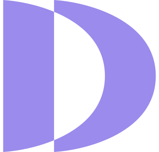

<p align="center">
  
</p>

# Discerns plugin for Claude Code

Turn your [Discerns](https://discerns.ai) digital brain into auto-invoking Claude skills. Install once, authenticate in your browser, and Claude can write in your voice, manage your relationships, capture and recall your knowledge, and help grow your brain — using your Discerns account under the hood.

## Install

```
/plugin marketplace add discerns-ai/discerns-plugin
/plugin install discerns@discerns
```

The first time a skill needs your brain, Claude Code opens your browser to sign in to Discerns (OAuth). Nothing is stored in this repo — you authenticate with your own account.

## Skills

| Skill | What it does | Example prompts |
| --- | --- | --- |
| `/discerns:discerns` | **Hub & router** — an overview of your brain, then sends you to the right skill. | "/discerns" · "what can my brain do?" |
| `/discerns:content` | Draft posts, emails, memos, briefs, and outlines grounded in your facts and written in your voice. | "Draft a LinkedIn post about our onboarding approach." |
| `/discerns:knowledge` | Answer questions strictly from your knowledge base (with sources), and add new facts. | "What do we know about enterprise SSO?" · "Add this to my brain." |
| `/discerns:people` | Recall who someone is before you act, and capture people, orgs, and interactions after. | "Who is elena@acme.com?" · "Log that I met Acme today." |
| `/discerns:gaps` | Review your learning backlog and fill it through a short interview. | "What should I teach my brain next?" |
| `/discerns:voice` | Define and manage how you sound per context. | "Set up my email voice." |

Skills also auto-invoke when your request matches — you don't have to call them by name. Not sure where to start? Run `/discerns` for an overview and routing.

## Permissions

Your Discerns API token decides what's possible:

- **Read-only token:** asking, recalling, and reviewing work everywhere.
- **Read-write token:** also enables capturing knowledge, managing people, filling gaps, and editing your voice.

If a skill needs write access you don't have, it will tell you. Upgrade your token in the Discerns dashboard.

## Develop & test locally

From the repository root:

```
# Load just this plugin from a local checkout
claude --plugin-dir ./plugins/discerns

# Validate the catalog and this plugin (incl. skill frontmatter)
claude plugin validate .
claude plugin validate ./plugins/discerns
```

Edit a `SKILL.md` and the change takes effect in the current session; changes to `.mcp.json` need `/reload-plugins` or a restart.

## Versioning

`version` is set in `.claude-plugin/plugin.json`. Bump it on every release so installed users receive the update. (Omit it to use the git commit SHA instead, which auto-updates on every commit.)

## License

MIT — see [LICENSE](LICENSE).
